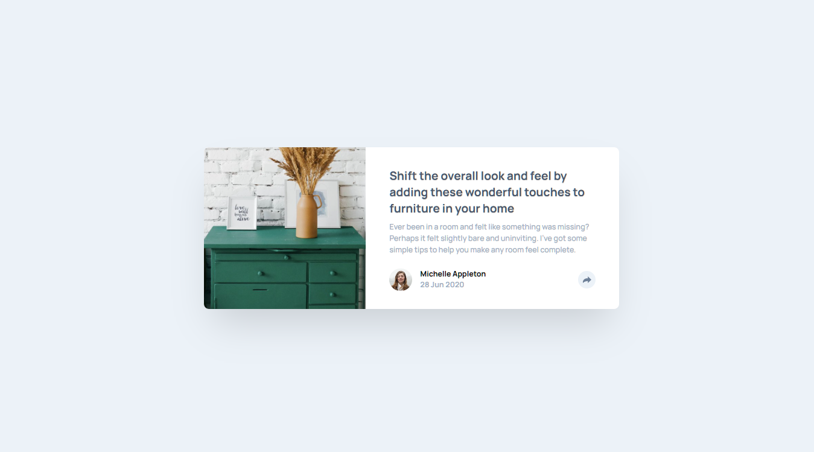

# Frontend Mentor - Article Preview Component

A responsive article preview card with interactive share functionality built with HTML, CSS, and JavaScript.

## Overview

### The Challenge

Build a responsive article preview component that:
- Adapts layout between mobile and desktop viewports
- Features an interactive share button with dropdown
- Includes social media sharing links
- Maintains proper accessibility and semantic markup

### Screenshot



### Links

- Solution URL: [Add your solution URL here](https://your-solution-url.com)
- Live Site URL: [Add your live site URL here](https://your-live-site-url.com)

## My Process

### Built With

- **HTML5** - Semantic markup with proper accessibility
- **Tailwind CSS** - Utility-first CSS framework with custom configuration
- **JavaScript** - Interactive dropdown functionality
- **BEM Methodology** - Organized naming conventions
- **Mobile-First Design** - Responsive approach

### What I Learned

#### CSS Positioning & Overflow Management
Learned how to handle dropdown positioning when parent containers have `overflow-hidden`:

```css
/* Solution: Position dropdown absolutely with high z-index */
.article-card__share-dropdown {
  position: absolute;
  z-index: 10;
  /* Positioned to break out of parent overflow */
}
```

#### Tailwind CSS Custom Utilities
Created custom text shadow utilities for consistent typography:

```javascript
// tailwind.config.js
'.text-shadow-md': {
  'text-shadow': '0 0.25rem 0.375rem rgba(0, 0, 0, 0.2)',
}
```

#### Individual Corner Rounding
Mastered targeting specific corners in Tailwind CSS:

```css
/* Different corners for mobile vs desktop */
.article-card__image {
  @apply lg:rounded-tl-[0.5rem] lg:rounded-bl-[0.5rem] lg:rounded-tr-none;
  @apply rounded-tl-[2rem] rounded-tr-[2rem];
}
```

#### JavaScript Event Handling
Implemented clean dropdown toggle functionality:

```javascript
shareButton.addEventListener('click', () => {
  shareDropdown.classList.toggle('opacity-0');
  shareDropdown.classList.toggle('pointer-events-none');
  
  // Dynamic button styling based on state
  if (shareDropdown.classList.contains('opacity-0')) {
    shareButton.classList.remove('active');
  } else {
    shareButton.classList.add('active');
  }
});
```

### Continued Development

Areas to explore in future projects:
- Advanced CSS animations and transitions
- Component-based architecture with modern frameworks
- Accessibility testing and optimization
- Performance optimization techniques

### Useful Resources

- [Tailwind CSS Documentation](https://tailwindcss.com/docs) - Comprehensive utility-first CSS framework
- [MDN Web Docs](https://developer.mozilla.org/) - Authoritative web development documentation
- [CSS Tricks](https://css-tricks.com/) - Great resource for CSS techniques
- [Frontend Mentor Community](https://www.frontendmentor.io/community) - Get feedback and learn from others

## AI Collaboration

This project was developed with AI assistance following structured learning principles:

### How AI Helped
- **Guided Learning**: Explanations of CSS concepts rather than complete solutions
- **Debugging Support**: Help identifying issues with positioning and responsive design
- **Best Practices**: Guidance on semantic HTML and accessibility considerations
- **Code Organization**: Assistance with BEM naming and Tailwind utility usage

### Learning Approach
- Focus on understanding "why" behind solutions
- Progressive hints to build problem-solving skills
- Emphasis on writing code independently
- Real-time debugging techniques with browser DevTools

### Key Takeaways
- Complex CSS positioning becomes manageable with systematic approach
- Tailwind CSS custom utilities streamline consistent styling
- JavaScript interactivity enhances user experience significantly

## Author

- Website - [Add your website here](https://www.your-site.com)
- Frontend Mentor - [@yourusername](https://www.frontendmentor.io/profile/yourusername)
- GitHub - [@yourusername](https://github.com/yourusername)

## Acknowledgments

- Frontend Mentor for the excellent challenge and design specifications
- Tailwind CSS team for the powerful utility-first framework
- The web development community for valuable learning resources
